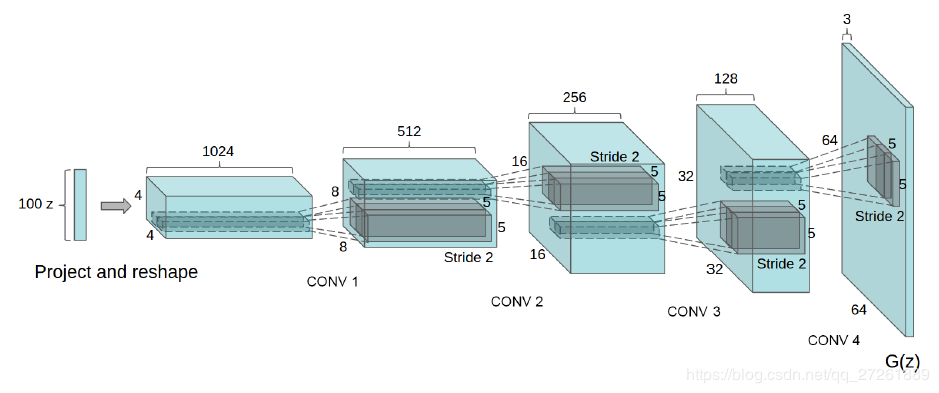
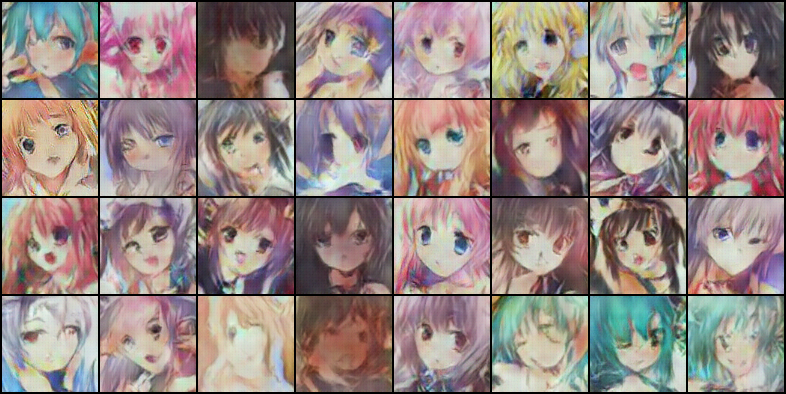

# GAN-over
Some GAN model trained by PyTorch

## DCGAN
> A simple PyTorch Implementation of Generative Adversarial Networks, focusing on anime face drawing.

### DCGAN Network Architecture


### Environment Requirement
```
torch==1.2.0
torchvision==0.4.0
Pillow==6.2.1
opencv-python
```

### Datasets
[Cartoon Faces Datasets](http://cloud.pekingmemory.cn/index.php/s/wLNX84Z4RGdIF3k)

keys:k8zf

The faces datasets should be saved in data/
### Usage
#### Catalogue
    /data
    /imgs
    /pth
    /test_imgs
    main.py
    model.py
    option.py
    test.py
    train.py


#### To train the model:

```
python main.py --mode train
```

The trained model would be saved in pth/

#### To test the model:

```
python main.py --mode test
```

The test output image would be saved in test_imgs/

#### Pretrained Model on GPU:
    /pth/netD_025.pth
    /pth/netG_025.pth

### Output

